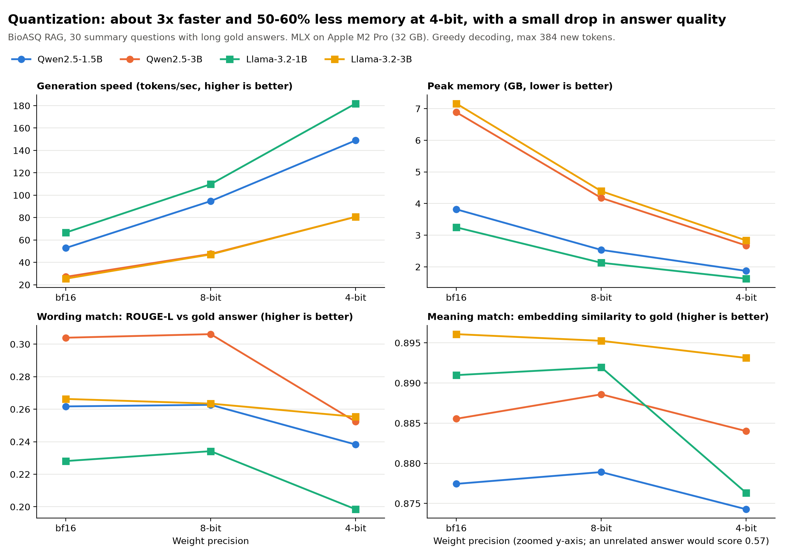
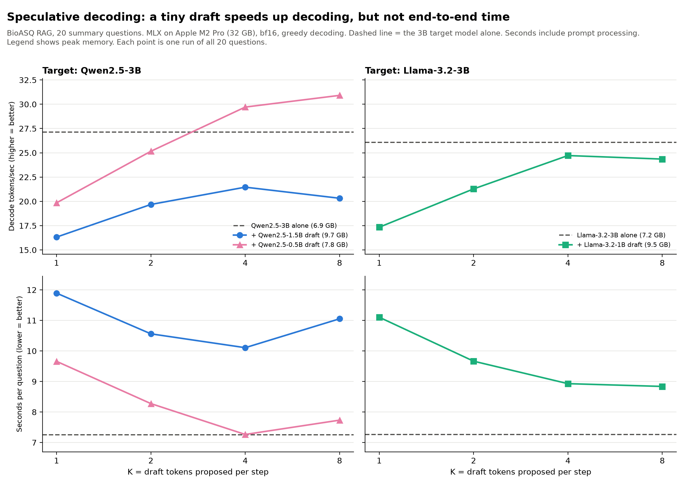

# Quantization and speculative decoding for biomedical RAG on a laptop

How much do two common inference decisions, **weight quantization** and **speculative decoding**, change speed, memory
and answer quality when small open LLMs answer biomedical questions from retrieved PubMed abstracts?

Everything runs locally on an Apple M2 Pro (32 GB) with [MLX](https://github.com/ml-explore/mlx). The code is plain Python
functions and flat scripts, with no agents and no LangChain/LlamaIndex, so each experiment can be read top to bottom.

## Results at a glance





- **8-bit quantization is nearly free.** 1.65-1.85x faster decoding and 34-39% less memory, with ROUGE-L within 0.006 and
  embedding similarity within 0.003 of bf16.
- **4-bit is a much bigger win for speed and memory,** at 2.7-3.2x faster decoding and 50-61% less memory. Answer *meaning*
  barely moves (embedding similarity drops at most 0.015), but *wording* match to the gold answer falls (ROUGE-L -0.011 to -0.052).
- **Speculative decoding only helped with a very small draft model, and only for decoding.** Qwen2.5-0.5B drafting for
  Qwen2.5-3B decoded 1.09-1.14x faster, but seconds per question were unchanged or worse (1.00-1.07x the time). Larger drafts
  (1.5B for 3B, Llama 1B for 3B) were slower than running the 3B model alone, and every draft added memory.

On this hardware and workload, quantization was the better lever. Details and caveats are below.

## What was done

**Task.** Answer BioASQ 12b biomedical questions using retrieved PubMed abstracts ([`mattmorgis/bioasq-12b-rag`](https://huggingface.co/datasets/mattmorgis/bioasq-12b-rag)),
then score each answer against the BioASQ gold answer.

**Pipeline** (`data.py`, `retrieve.py`, `generate.py`, `prompts.py`):
1. Load questions and the PubMed corpus from Hugging Face.
2. Embed passages (title + abstract) with `BAAI/bge-small-en-v1.5` and index them in an exact FAISS inner-product index.
3. For each question, retrieve the top 5 passages and build one prompt: *"answer using only these passages, cite passage IDs."*
4. Cache the prompts, so **every model and setting sees identical input** (`prompts.py`).

**Evaluation set.** 30 *summary*-type questions from the dev split whose gold answer is at least 30 words (median 53 words),
so quality is compared on long answers. The speculative-decoding runs use the first 20 of them. Each experiment uses a
2,000-passage corpus made of all relevant passages for these questions plus random distractors. On these questions, top-5
retrieval returned at least one relevant passage for 30/30 questions. *Precision@5* (the share of the 5 retrieved passages
that BioASQ marks as relevant) was 0.81, and *recall@5* (the share of a question's relevant passages found in the top 5) was
0.56. Questions have a median of 9 relevant passages, so top-5 recall is capped near 5/9.

**Models.** Qwen2.5-1.5B/3B-Instruct and Llama-3.2-1B/3B-Instruct. Quantized variants are the pre-built
`mlx-community/<model>-{bf16,8bit,4bit}` checkpoints, so I did not quantize anything myself.

**Fixed for every run.** Same prompts, same top-5 passages, greedy decoding, max 384 new tokens, one untimed warm-up
generation per model, then timed runs.

### Experiment 1: quantization (`quantization.py`)
Each of the 4 models runs in bf16, 8-bit and 4-bit over the 30 questions (360 answers).

### Experiment 2: speculative decoding (`speculative.py`)
A small *draft* model from the same family guesses the next K tokens, and the larger *target* model checks all K in one pass,
keeping the guesses up to the first disagreement plus one token of its own. With greedy decoding the output should match
the target alone. Tested at bf16 only (kept separate from quantization), for K = 1, 2, 4, 8:

| Target | Drafts tried |
|---|---|
| Qwen2.5-3B | Qwen2.5-1.5B, Qwen2.5-0.5B |
| Llama-3.2-3B | Llama-3.2-1B |

## How the metrics are computed

| Metric | Definition |
|---|---|
| Tokens/sec | MLX's decode speed for each answer (output tokens per second while writing, excluding prompt processing), averaged over questions |
| Seconds per question | Stopwatch around the whole request: prompt processing plus decoding |
| Peak memory (GB) | `mx.get_peak_memory()` (decimal GB) at the end of each answer. In the quantization runs it is reset before the weights load; in the speculative runs it is reset after loading, so "target alone" excludes the draft |
| ROUGE-L | Word-overlap (longest common subsequence) F-score between answer and gold answer. Strict: a correct paraphrase scores low |
| Meaning match | Cosine similarity of `bge-small` embeddings of answer and gold answer. An answer paired with a *different* question's gold answer scores about 0.57, which is the floor on this scale |

## Quantization results

Each value is the mean over 30 questions. Speed and memory are shown relative to bf16 for the same model.

| Model | Precision | Tokens/sec | Peak memory | ROUGE-L | Meaning match |
|---|---|---|---|---|---|
| Qwen2.5-1.5B | bf16 | 52.8 | 3.82 GB | 0.262 | 0.877 |
| | 8-bit | 94.7 (1.79x) | 2.54 GB (-34%) | 0.263 | 0.879 |
| | 4-bit | 148.9 (2.82x) | 1.87 GB (-51%) | 0.238 | 0.874 |
| Qwen2.5-3B | bf16 | 27.1 | 6.89 GB | 0.304 | 0.886 |
| | 8-bit | 47.5 (1.75x) | 4.18 GB (-39%) | 0.306 | 0.889 |
| | 4-bit | 80.6 (2.98x) | 2.67 GB (-61%) | 0.252 | 0.884 |
| Llama-3.2-1B | bf16 | 66.6 | 3.25 GB | 0.228 | 0.891 |
| | 8-bit | 109.8 (1.65x) | 2.13 GB (-34%) | 0.234 | 0.892 |
| | 4-bit | 181.9 (2.73x) | 1.63 GB (-50%) | 0.198 | 0.876 |
| Llama-3.2-3B | bf16 | 25.4 | 7.16 GB | 0.266 | 0.896 |
| | 8-bit | 47.1 (1.85x) | 4.39 GB (-39%) | 0.263 | 0.895 |
| | 4-bit | 80.7 (3.18x) | 2.83 GB (-60%) | 0.255 | 0.893 |

4-bit models also write longer answers (for example Qwen2.5-1.5B averaged 77 tokens at bf16 and 104 at 4-bit), which can lower
ROUGE-L without changing the meaning. I did not test whether that explains the drop.

I first ran with a 256-token limit, and 0-20% of answers hit it. Raising the limit to 384 reduced truncation to 0-10% but
changed no score by more than 0.01, so the limit was not driving the 4-bit ROUGE-L drop. The 256-token results are in
`results/quantization_256tok.csv`.

## Speculative decoding results

K = 4 and K = 8 were the best settings (full sweep in the chart and `results/speculative.csv`). Speed ratios are decode speed
relative to the target model alone; the time ratio is seconds per question.

| Target | Setup | Tokens/sec | Seconds/question | Peak memory |
|---|---|---|---|---|
| Qwen2.5-3B | alone | 27.1 | 7.25 | 6.9 GB |
| | + 1.5B draft, K=4 | 21.5 (0.79x) | 10.11 (1.39x) | 9.7 GB |
| | + 1.5B draft, K=8 | 20.3 (0.75x) | 11.05 (1.52x) | 9.7 GB |
| | + **0.5B** draft, K=4 | 29.7 (1.09x) | 7.26 (1.00x) | 7.8 GB |
| | + **0.5B** draft, K=8 | 30.9 (1.14x) | 7.73 (1.07x) | 7.8 GB |
| Llama-3.2-3B | alone | 26.1 | 7.26 | 7.2 GB |
| | + 1B draft, K=4 | 24.7 (0.95x) | 8.93 (1.23x) | 9.5 GB |
| | + 1B draft, K=8 | 24.4 (0.93x) | 8.84 (1.22x) | 9.5 GB |

- **Why no end-to-end gain?** Decoding time fell by roughly 15% for the 0.5B draft at K=4, but the remainder of the request
  (mostly processing the ~1,900-token RAG prompt) grew from about 2.3 s to about 3.1 s. My reading is that the draft model also
  has to process that long prompt. This comes from splitting the timings, not from a direct measurement.
- **A larger K stops helping.** Later guesses in a batch are the least likely to match, and one wrong guess discards the rest.
- In bf16, the speculative answers matched the target-alone answers for only 40-65% of questions even though decoding is greedy.
  I did not determine why; bf16 rounding differences are the likely cause. Earlier smoke tests at 4-bit matched exactly.

## Limitations

- **One Mac, one run per setting, 20-30 questions.** Differences of a few percent (for example ROUGE-L 0.01-0.02, or a speed ratio
  near 1.0) are within what I would expect from run-to-run noise. I did not measure that noise.
- **The retrieval corpus is 2,000 passages, not the full 49.5k.** Retrieval is therefore easier than in a real deployment.
- **Quality is measured against one gold answer** with two overlap metrics. There is no check of factual correctness,
  faithfulness to the passages, or hallucination, and no human or LLM judge.
- **Results are MLX on Apple Silicon.** They will not transfer directly to CUDA/vLLM, where kernels and memory behave differently.
- **Quantization and speculative decoding were deliberately tested separately.** Their combination was not tested.
- **Memory is MLX's own accounting of unified memory,** not an operating-system measurement.

## Code tour

```
data.py            load BioASQ questions + PubMed corpus, pick the evaluation subset
retrieve.py        bge embeddings, FAISS index, top-k retrieval
generate.py        prompt builder (+ a PyTorch generation helper used by run_rag.py)
prompts.py         retrieve once and cache prompts so all models see identical input
mlx_gen.py         one function: greedy generation with MLX, optionally with a draft model
quantization.py    experiment 1  ->  results/quantization.csv
speculative.py     experiment 2  ->  results/speculative.csv
plot_*.py          the two charts
run_rag.py         end-to-end RAG demo (retrieval + generation, PyTorch)
benchmark.py       PyTorch fp16 comparison of the 4 models; written early on, not part of the reported results
common.py          constants (models, top-k, token limit) and the GPU/HF-token helpers
```

### Retrieval (`retrieve.py`)

```python
def build_index(docs, embedder):
    vecs = embedder.encode([f"{d['title']}\n{d['text']}" for d in docs], batch_size=64, normalize_embeddings=True)
    index = faiss.IndexFlatIP(vecs.shape[1])  # exact cosine search (vectors are normalized)
    index.add(vecs)
    return index


def retrieve(question, index, docs, embedder, k):
    query = embedder.encode([QUERY_PREFIX + question], normalize_embeddings=True)
    _, ids = index.search(query, k)
    return [docs[i] for i in ids[0]]
```

### Generation (`mlx_gen.py`), the one function both experiments share

```python
def generate(model, tokenizer, prompt, draft_model=None, num_draft_tokens=4):
    """Greedy generation with MLX. Returns (answer, final response stats, draft acceptance rate)."""
    chat = tokenizer.apply_chat_template([{"role": "user", "content": prompt}], add_generation_prompt=True)
    text, from_draft = "", []
    for r in stream_generate(model, tokenizer, chat, max_tokens=MAX_NEW_TOKENS,
                             draft_model=draft_model, num_draft_tokens=num_draft_tokens):
        text += r.text
        from_draft.append(r.from_draft)
    return text, r, sum(from_draft) / len(from_draft)  # share of output tokens that came from the draft model
```

### Quantization loop (`quantization.py`)

```python
for name in args.models:
    for precision in PRECISIONS:                      # bf16, 8bit, 4bit
        mx.reset_peak_memory()                        # so peak memory covers loading the weights
        model, tokenizer = load(f"mlx-community/{name}-{precision}")
        generate(model, tokenizer, prompts[0]["prompt"])  # untimed warm-up
        for p in prompts:
            start = time.perf_counter()
            answer, r, _ = generate(model, tokenizer, p["prompt"])
            rows.append({"model": name, "precision": precision, "answer": answer,
                         "seconds": time.perf_counter() - start, "tokens_per_sec": r.generation_tps,
                         "peak_memory_gb": r.peak_memory, ...})
```

Quality is scored after all models are freed: ROUGE-L against the gold answer, and cosine similarity between `bge` embeddings of
the answer and the gold answer.

### Speculative decoding loop (`speculative.py`)

```python
for target, draft_names in TARGETS.items():
    model, tokenizer = load(f"mlx-community/{target}-bf16")
    rows += run(target, "none", 0, model, tokenizer)           # target alone = baseline
    for draft_name in draft_names:
        draft, _ = load(f"mlx-community/{draft_name}-bf16")
        for k in K_VALUES:                                      # 1, 2, 4, 8 draft tokens per step
            rows += run(target, draft_name, k, model, tokenizer, draft)
```

## Reproduce

Requires an Apple Silicon Mac and Python 3.13 (versions used are pinned in `requirements.txt`).

```bash
pip install -r requirements.txt
huggingface-cli login          # needed for the Llama models (accept the license on Hugging Face first)

# if model loading ever segfaults on macOS, set HF_DEACTIVATE_ASYNC_LOAD=1
# run on a plugged-in Mac and don't use it meanwhile; caffeinate keeps it awake so timings are not throttled
caffeinate -i python quantization.py --n-questions 30   # ~25 min once models are cached; writes results/quantization.csv
caffeinate -i python speculative.py  --n-questions 20   # ~45 min once models are cached; writes results/speculative.csv
python plot_quantization.py
python plot_speculative.py
```

The first run downloads the models (tens of GB across all precisions and drafts) and builds the prompt cache in `results/`.
Never commit your Hugging Face token. It is read from the environment or the Hugging Face login cache and is never printed.

## Project history

The original plan was a Kaggle CUDA GPU benchmark with vLLM, including speculative decoding. I switched to MLX so everything
could run locally, which also made quantization easy to test. An earlier PyTorch/MPS pass (`benchmark.py`) found that
Gemma 3 returns empty text in fp16 (it overflows and needs bf16), so Gemma was dropped and the study focuses on Qwen and Llama.
